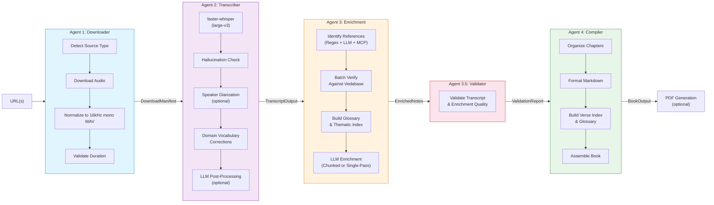
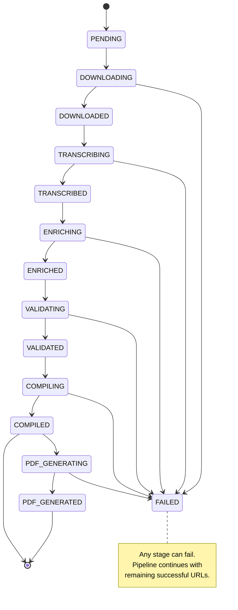
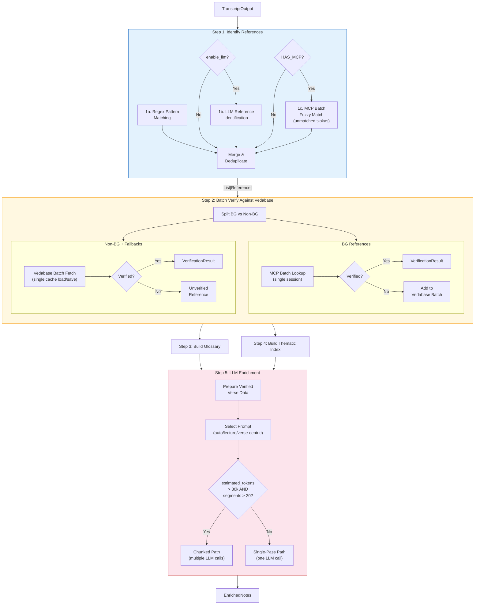
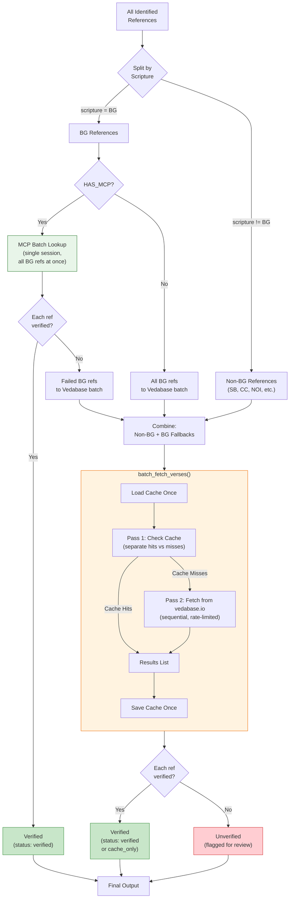
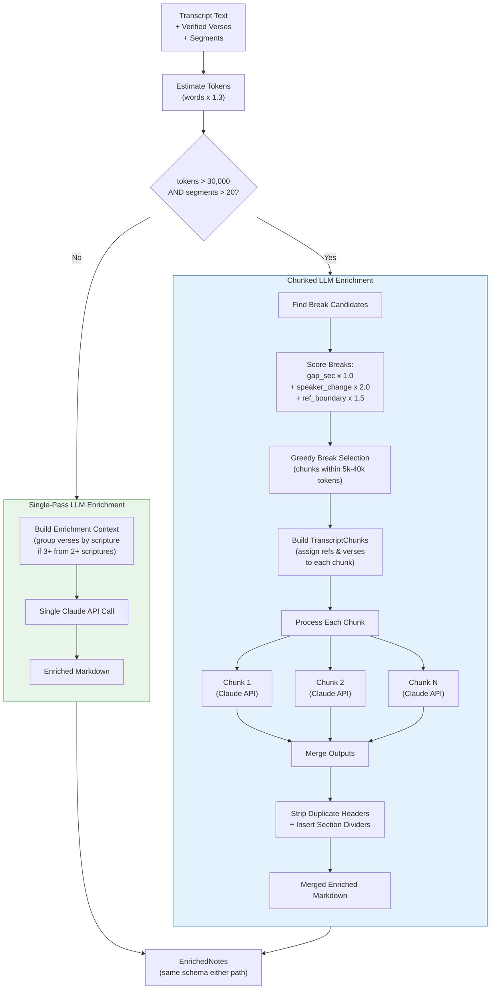
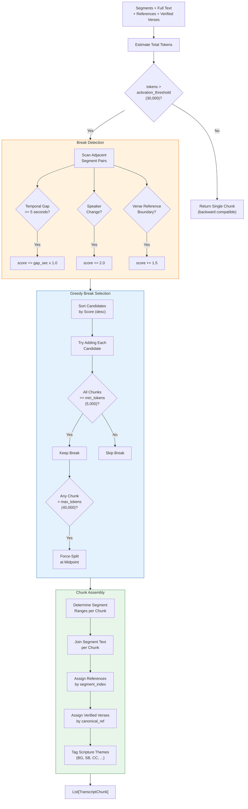
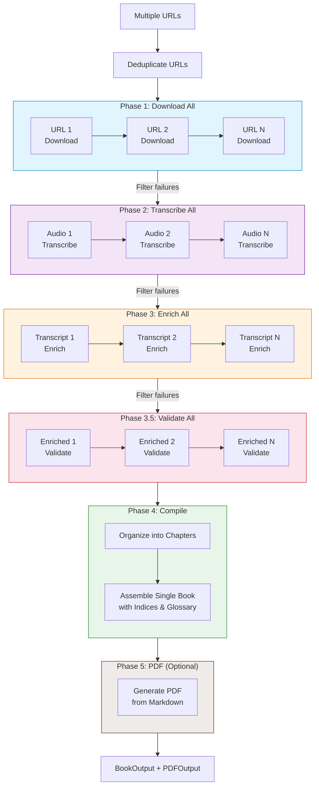
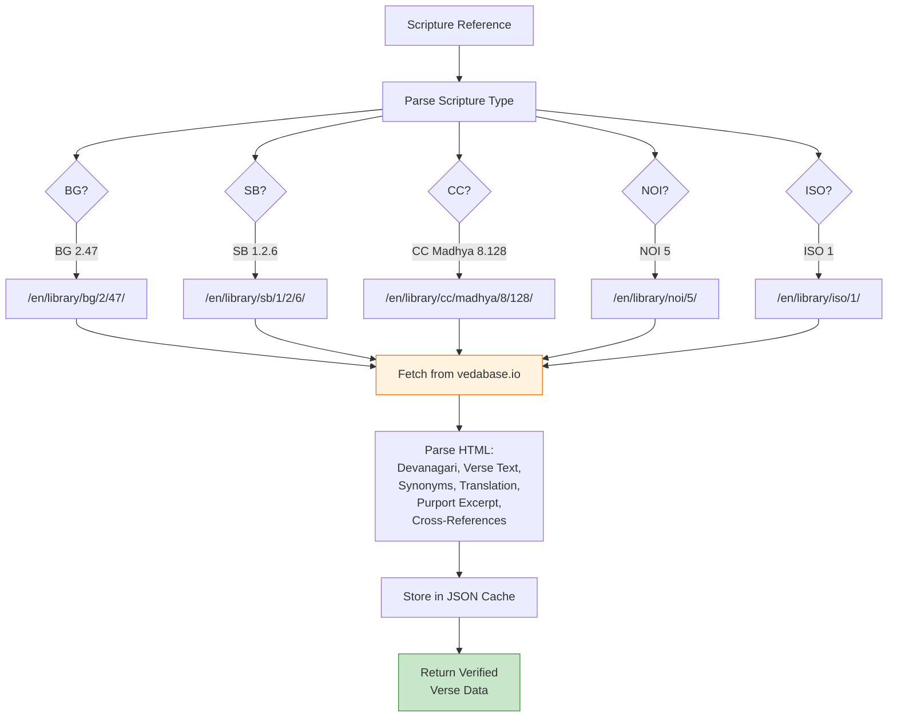

# Architecture Diagrams

## 1. Pipeline Overview



## 2. Pipeline State Machine



## 3. Enrichment Agent — Full Flow



## 4. Batch Verification Strategy



## 5. Chunk with Purpose — Decision & Processing Flow



## 6. Transcript Chunker Algorithm



## 7. Enrichment Prompt Selection

```mermaid
flowchart TD
    verses["Verified Verse Data"] --> mode{"enrichment_mode?"}

    mode -->|"'auto'"| auto_check{"Verified\nverses <= 2?"}
    mode -->|"'lecture-centric'"| lecture["Lecture-Centric Prompt\n(v7.0)\nFocuses on speaker's\nteaching narrative"]
    mode -->|"'verse-centric'"| verse["Verse-Centric Prompt\n(v6.0)\nFocuses on scripture\nexposition & purports"]

    auto_check -->|Yes| lecture
    auto_check -->|No| verse

    lecture --> context["Build LLM Context"]
    verse --> context

    context --> group_check{"3+ verses from\n2+ scriptures?"}
    group_check -->|Yes| grouped["Group Verses by Scripture\n\nBhagavad-gita References\n  BG 2.47, BG 9.34\nSrimad-Bhagavatam References\n  SB 1.2.6, SB 3.25.21"]
    group_check -->|No| flat["Flat Chronological List\n\nBG 2.47\nBG 9.34"]

    grouped --> call["Claude API Call"]
    flat --> call

    style lecture fill:#e8f5e9,stroke:#2e7d32
    style verse fill:#e3f2fd,stroke:#1565c0
    style grouped fill:#fff3e0,stroke:#ef6c00
```

## 8. Multi-URL Pipeline Flow



## 9. Vedabase URL Pattern Resolution


